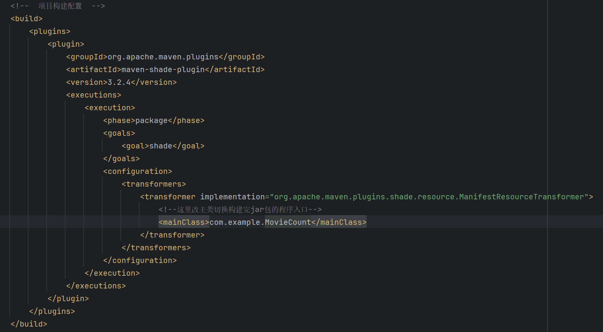

# 柚子茶的分布式课设

使用maven作为依赖管理和项目构建工具
安装和配置maven看[这篇文章](https://open.alipay.com/portal/forum/post/137701043)

# 手动构建jar程序(不推荐)

把项目clone下来后执行以下命令安装依赖
```shell
mvn clean install 
```

修改pom.xml中的mainClass的值

一共有三个值可以选,分别对应三道题:
1. com.example.MovieCount(第一题: 统计每种电影题材的电影数量并输出)
2. com.example.MovieSortByYearAndScore(第二题: 根据电影题材分类电影，并按年份（大小），分数（高低）输出)
3. com.example.MovieSortByVote(第三题: 根据投票数量（高低）对电影进行排序并输出)

修改完执行以下命令构建jar包
```shell
mvn clean package
```

执行成功后会在 **target** 目录下出现 "shit-distributed-1.0.jar" 这个jar包
即对应题目的程序

# 直接用现成的(推荐)

**works** 目录下的内容包含四个文件, 看文件名就知道对应是哪道题了。

